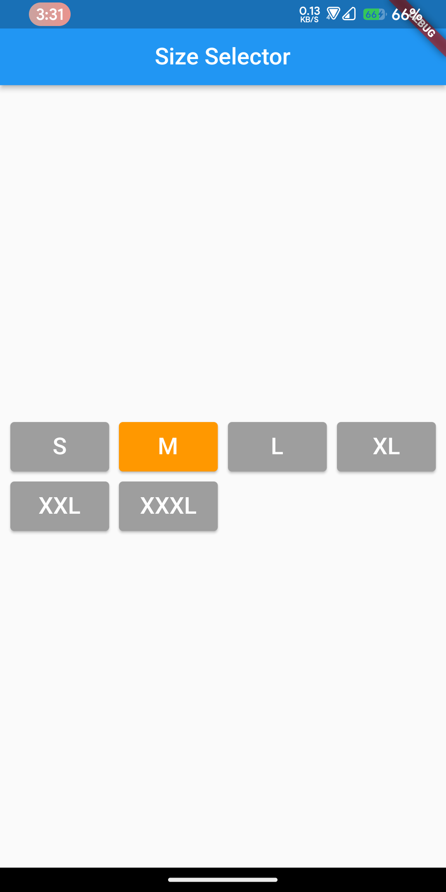

# module9_live_test

## Question

Design the following screen. On tapping on a button the colour of that button will be changed and reset the previous selected one. Also show a Snackbar on each button press with the selected Size text.

 