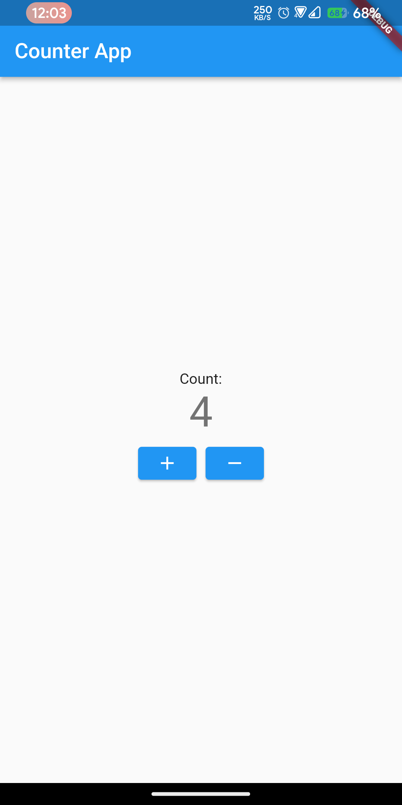
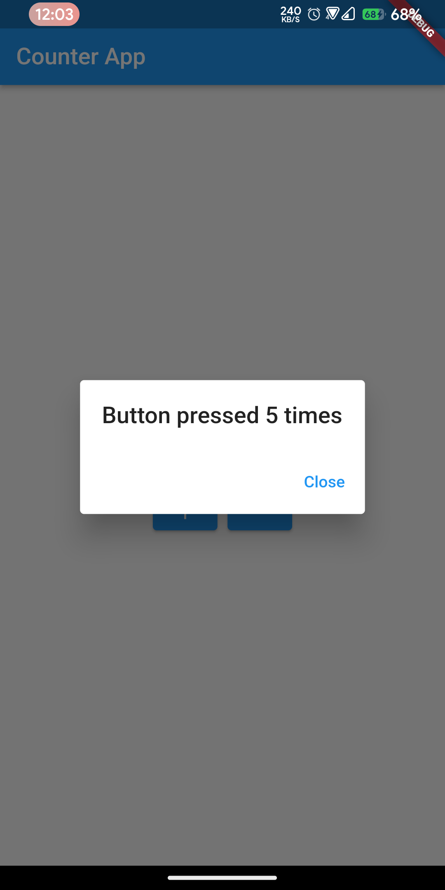

# module7_live_test

## Question
Create a Flutter screen that initially displays a count of 0. The screen should have two buttons: one labeled "+" and the other labeled "-".
  
### Requirements:
Tapping the "+" button should increase the count by 1.
Tapping the "-" button should decrease the count by 1, but the count should not go below 0.
If the count reaches 5 or more, a dialog should appear with the message: "Button pressed {count} times."