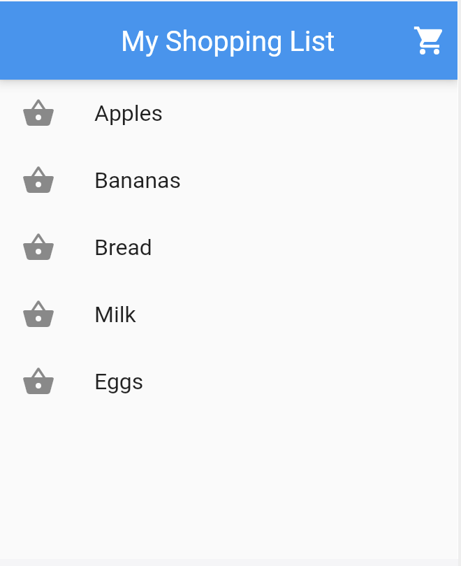

# module6_live_test

স্বাগতম সবাইকে Flutter Essential Widgets লাইভ টেস্টে। 
Create a single page that displays a list of items.

Requirements:
An app bar titled "My Shopping List.", with a cart icon.
A list of at least 5 shopping items displayed using ListTile widgets.
Each item should have an icon (use any icon) and a name (name of any object). Apply suitable styling for visual appeal.