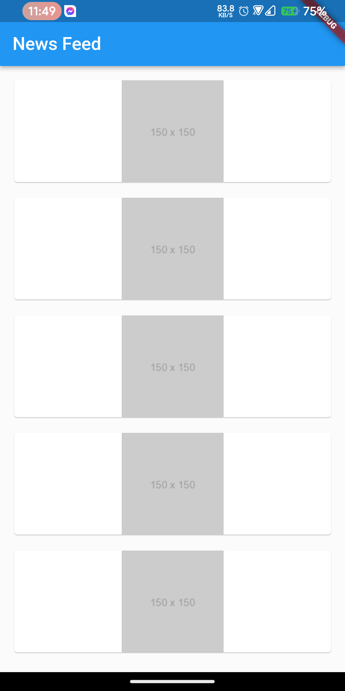
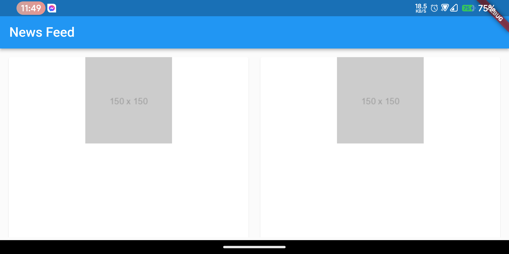

# module8_live_test

## Question

Create a dummy image feed that adjusts its layout based on the device's orientation. 

1. The feed should display multiple thumbnail images in list format for portrait and grid format in landscape.

2. Use a Card or Container type widget to hold the thumbnail image (Can use image/images of your choice, they will be 150x150 in size or use this image -> “https://via.placeholder.com/150”) 

1. Show at least 10 items on screen.

4. On GridView the crossAxis count will be minimum 2.

 